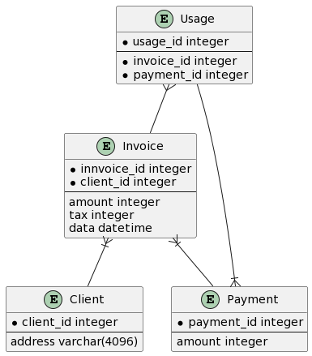

## Cross-cutting Concepts

<!-- В этом разделе описываются общие, основные положения и идеи решений которые относятся к нескольким частям вашей системы.
Такие "концепции" часто связаны с несколькими строительными блоками. Они могут включать в себя множество различных тем, таких как:

- логические модели данных
- потоки данных между системами
- правила использования конкретной технологии
- инфраструктурные варианты использования (логирование и трасиировка, авторизация, ауктентификация, хранение секретов, мониторинг, правила кеширования, политика установки обновлений, правила версионирования интерфейсов и правила обработки ошибок в интерфейсах) -->

### Логическая модель данных

|Сущность|Назначение|
---------|-----------
|Client|Клиент, которому выставляются счета|
|Invoice|Ежемесячный счет клиенту|
|Payment|Платеж по подписке|
|Usage|Информация о потреблении услуг|